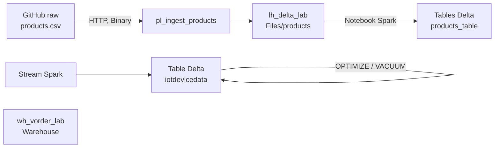

# Lab 03 — Delta Lake : maintenance, V-Order et seuils Direct Lake

> **Statut** : en cours · **Stack** : Microsoft Fabric (Lakehouse, Spark, Data Pipeline, Warehouse) · **Domaines DP-700** : 2 (Ingest and transform), 3 (Monitor and optimize)

## En bref

- Ingestion d'un fichier source par **pipeline** vers la zone Bronze d'un Lakehouse, au lieu d'un téléversement manuel.
- Mesure, sur une vraie table Delta, de l'effet des **petits fichiers**, de **V-Order**, d'**OPTIMIZE** et de **VACUUM** (nombre de fichiers, taille moyenne, historique).
- Vérification du comportement de V-Order côté **Warehouse**, et lien avec les **seuils Direct Lake** de Power BI.

## Démarche

Chaque étape suit le même cycle : **je note une prédiction, j'exécute, je compare**. Les écarts sont consignés dans le [journal de résultats](#journal-de-résultats). Une hypothèse réfutée y a autant de valeur qu'une hypothèse confirmée.

## Architecture



| Élément | Nom | Rôle |
|---|---|---|
| Workspace | `ws_dp700_lab` | Workspace de lab, sans Deployment Pipeline |
| Lakehouse | `lh_delta_lab` | Zone Bronze (Files) et tables Delta |
| Pipeline | `pl_ingest_products` | Copie de `products.csv` depuis GitHub |
| Warehouse | `wh_vorder_lab` | Observation de V-Order côté T-SQL |

Point de départ : le lab officiel Microsoft [Use delta tables in Apache Spark](https://microsoftlearning.github.io/mslearn-fabric/Instructions/Labs/03-delta-lake.html), que j'ai étendu (ingestion par pipeline, maintenance, Warehouse).

## 1. Ingestion par pipeline (zone Bronze)

Le lab officiel téléverse le fichier à la main. Je le remplace par une activité Copy, comme en production.

| Réglage | Valeur | Pourquoi |
|---|---|---|
| Activité | `cp_http_products_csv` | Lisible dans le Monitoring hub |
| Timeout / retries | 10 min / 2 tentatives à 30 s | Détecter vite un blocage, absorber une erreur ponctuelle |
| Connexion source | `conn_http_github_raw` (URL de base `https://raw.githubusercontent.com/`) | Une connexion par source, réutilisable |
| Relative URL | `MicrosoftLearning/dp-data/main/products.csv` | Le chemin seul, ajouté à l'URL de base |
| Format | Binary des deux côtés | Copie fidèle, sans interprétation des colonnes ([ADR 0001](../decisions/0001-copie-binaire-bronze.md)) |
| Destination | `Files/products/products.csv` | Fichier brut ; la section Tables est réservée au Delta |

**Ce que la pratique m'a appris**

- Dans *Manage connections and gateways*, une connexion HTTP se crée avec le type **Web** ; le pipeline l'affiche ensuite comme HTTP.
- *Relative URL* s'ajoute à l'URL de base : une connexion qui pointe sur l'URL complète d'un fichier ne sert qu'à ce fichier.
- En Binary, *Preview data* et *Mapping* sont grisés : le pipeline ne lit pas les colonnes.
- Le *Request timeout* (onglet Source) couvre un appel HTTP ; le *Timeout* (onglet General) couvre toute l'activité, retries compris.
- Le connecteur Lakehouse n'accepte qu'un compte utilisateur, ce qui pose la question de l'identité d'écriture ([ADR 0002](../decisions/0002-identite-destination-lakehouse.md)).

**Incident en cours d'analyse** : *Test connection* échoue en `WebRequestTimeout`, sur la nouvelle connexion comme sur l'ancienne. Mon hypothèse de départ (erreur 400/404 sur la racine du site) est réfutée. Prochaines vérifications : exécution réelle du pipeline, protection d'accès sortant du workspace, puis `requests.get` depuis un notebook.

## 2. Tables Delta et historique

Sur `products_table`, créée depuis le CSV :

- `DESCRIBE DETAIL` expose `numFiles` et `sizeInBytes`, les deux indicateurs utilisés dans la suite.
- `DESCRIBE HISTORY` montre qu'un `UPDATE` **réécrit des fichiers** (fichiers ajoutés et retirés dans `operationMetrics`) au lieu de modifier une ligne sur place.
- Le time travel (`VERSION AS OF 0`) ne fonctionne que tant que les anciens fichiers existent : c'est précisément ce que VACUUM supprime.

La section streaming du lab alimente `iotdevicedata` : chaque micro-lot écrit au moins un fichier, origine typique des petits fichiers.

## 3. Petits fichiers, V-Order, OPTIMIZE, VACUUM

```python
# Simuler une ingestion fréquente : 20 ajouts d'une ligne
from pyspark.sql import Row
for i in range(20):
    spark.createDataFrame([Row(device=f"Dev{i % 3}", status="ok")]) \
        .write.format("delta").mode("append").saveAsTable("dbo.iotdevicedata")
```

```sql
-- État de V-Order dans la session
SET spark.sql.parquet.vorder.default;

-- Compacter et appliquer V-Order en une commande
OPTIMIZE dbo.iotdevicedata VORDER;

-- Aperçu de ce que VACUUM supprimerait (rétention par défaut : 7 jours)
VACUUM dbo.iotdevicedata DRY RUN;
```

```python
# Contrôle de santé : taille moyenne des fichiers
d = spark.sql("DESCRIBE DETAIL dbo.iotdevicedata").first()
n = d["numFiles"]
print(f"Fichiers : {n}")
print(f"Taille moyenne : {d['sizeInBytes'] / n / 1024**2:.3f} MB" if n else "Table vide")
```

Pour observer la perte du time travel, le lab prévoit aussi un `VACUUM ... RETAIN 0 HOURS`, après désactivation du garde-fou de rétention. C'est à réserver à un lab : en production, cela détruit l'historique.

## 4. Warehouse : état de V-Order

```sql
SELECT [name], [is_vorder_enabled] FROM sys.databases;
```

- V-Order est activé par défaut dans un Warehouse.
- `ALTER DATABASE CURRENT SET VORDER = OFF` s'applique à tout le warehouse et est **irréversible**. Je ne l'ai pas exécuté ; le cas d'usage légitime est un warehouse de staging distinct du warehouse lu par Power BI.
- `OPTIMIZE` et `VACUUM` sont des commandes Spark : l'éditeur T-SQL du Warehouse ne les accepte pas, et le Warehouse gère lui-même sa maintenance.

## Journal de résultats

| Étape | Question | Prédiction | Résultat | Écart / explication |
|---|---|---|---|---|
| 1 | *Test connection* sur `conn_http_github_raw` | Erreur 400/404 sur la racine | `WebRequestTimeout` | Hypothèse réfutée |
| 1 | *Test connection* sur l'ancienne connexion (URL complète) | — | `WebRequestTimeout` | Problème général, pas lié à la nouvelle connexion |
| 1 | Run du pipeline : dossier `products` absent → échec ou création ? | | | |
| 1 | Second Run : un fichier ou deux ? | | | |
| 2 | `numFiles` de `products_table` après création | | | |
| 2 | Fichiers ajoutés / retirés par l'`UPDATE` | | | |
| 3 | `numFiles` de `iotdevicedata` après le stream | | | |
| 3 | `numFiles` après 20 ajouts | | | |
| 3 | Valeur de `vorder.default` | | | |
| 3 | `numFiles` après `OPTIMIZE` | | | |
| 3 | Taille moyenne des fichiers avant / après `OPTIMIZE` | | | |
| 3 | Time travel après `OPTIMIZE` | | | |
| 3 | Fichiers listés par `VACUUM DRY RUN` | | | |
| 3 | Time travel après `VACUUM RETAIN 0 HOURS` | | | |
| 3 | `numFiles` après les 20 ajouts, avec auto compaction | | | |
| 4 | `is_vorder_enabled` du Warehouse | | | |
| 4 | `VACUUM` depuis l'éditeur SQL | | | |

## Ce que j'en retiens

| Besoin | Outil | Remarque |
|---|---|---|
| Trop de petits fichiers, requêtes lentes | `OPTIMIZE` (avec `VORDER` dans un Lakehouse) | Compacte ; n'efface rien |
| Récupérer du stockage, supprimer les vieux fichiers | `VACUUM` depuis Spark | N'accélère pas les requêtes ; coupe le time travel au-delà de la rétention |
| Lectures rapides par Power BI Direct Lake | V-Order | Actif par défaut dans un Warehouse ; désactivé par défaut dans les Lakehouses des workspaces récents (profil `writeHeavy`) |
| Chargements lents sur des tables lues une fois | V-Order désactivé sur un warehouse de staging dédié | Irréversible |
| Table au-dessus du seuil Direct Lake du SKU | Augmenter la capacité, ou réduire la table | Sinon, bascule en DirectQuery ou erreur |

Seuils Direct Lake par table (extrait) : F2 à F32, 1 000 fichiers Parquet et 300 M lignes ; F64, 5 000 fichiers et 1,5 Md lignes.

**En entreprise** : un profil de ressources par couche (`writeHeavy` pour l'ingestion, `readHeavyForPBI` pour Gold), auto compaction sur les tables alimentées en continu, V-Order réservé aux tables lues par Direct Lake, `OPTIMIZE` et `VACUUM` planifiés par un notebook de maintenance paramétré, avec alerte en cas d'échec.

## Décisions liées

- [ADR 0001 — Copie binaire vers Bronze](../decisions/0001-copie-binaire-bronze.md)
- [ADR 0002 — Identité de destination Lakehouse](../decisions/0002-identite-destination-lakehouse.md)

## Sources

- [V-Order et optimisation Delta dans le Lakehouse](https://learn.microsoft.com/en-us/fabric/data-engineering/delta-optimization-and-v-order)
- [Profils de ressources](https://learn.microsoft.com/en-us/fabric/data-engineering/configure-resource-profile-configurations)
- [V-Order dans le Warehouse](https://learn.microsoft.com/en-us/fabric/data-warehouse/v-order) · [Désactiver V-Order](https://learn.microsoft.com/en-us/fabric/data-warehouse/disable-v-order)
- [VACUUM](https://learn.microsoft.com/en-us/fabric/data-engineering/delta-lake-vacuum) · [Compactage](https://learn.microsoft.com/en-us/fabric/data-engineering/table-compaction)
- [Maintenance des tables multi-moteurs](https://learn.microsoft.com/en-us/fabric/fundamentals/table-maintenance-optimization)
- [Direct Lake](https://learn.microsoft.com/power-bi/enterprise/directlake-overview) · [Performance Direct Lake](https://learn.microsoft.com/en-us/fabric/fundamentals/direct-lake-understand-storage)
